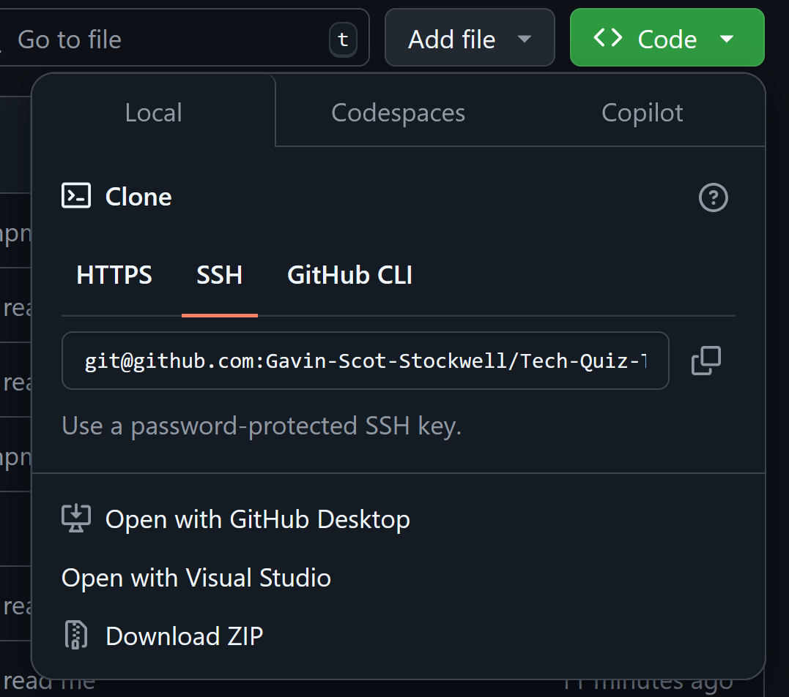

# Tech Quiz Test Suite

## License

# Table Of Contents
* [Description](#description)
* [Installation](#installation)
* [Usage](#usage)
* [License](#license)
* [Contributing](#contributing)
* [Tests](#tests)
* [Questions](#questions)

## Description
A homework project that focused on getting cypress working with e2e.

## Installation
How to download
* Go to get hub page https://github.com/Gavin-Scot-Stockwell/Tech-Quiz-Test-Suite
* either download via the zip file or do a pull form github
 

## Usage
* Use the cypress app to test the html of the quiz with the built in 

## Contributing
* Gavin Stockwell -cypress

## Tests
* After the download you must do the following
* At the server and client do "npm i" and "npm run build" at root that will get the project set up
* Next, staying in the root, "npm run start:dev", following that type in "npx cypress open"
* At this point cypress should be open
* Choose e2e testing, and then click your web browser of choice
* lastly click on quiz and watch the testing

* Here is a video to follow instead https://youtu.be/P9zSiCczGZE

## Questions
* GitHub-username https://github.com/Gavin-Scot-Stockwell
* Email-address gsstockwell@gmail.com

